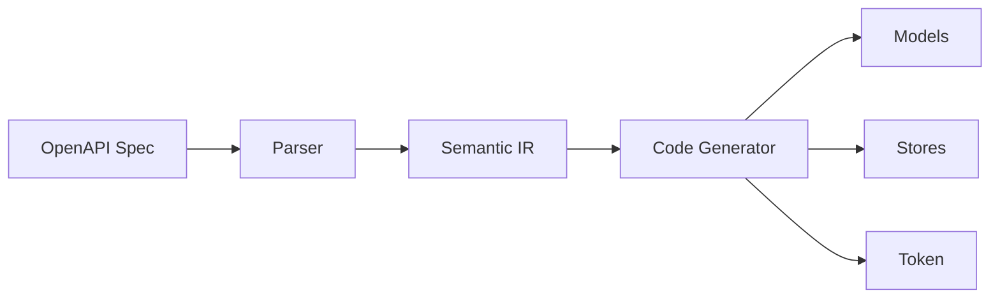

# Architecture

## Generation Pipeline



## Output Structure

```
generated/
└── <api-slug>/
    ├── api-base-path.token.ts
    └── <domain>/
        ├── application/<domain>.store.ts
        └── entities/<entity>.model.ts
```

## Generated Store Pattern

```typescript
export const TaskStore = signalStore(
  { providedIn: 'root' },

  // Base URL injection
  withProps(() => ({
    _baseUrl: inject(TASKS_API_BASE_PATH),
  })),

  // State for params and selection
  withState({
    tasksParams: {} as { status?: string },
    selectedTaskId: undefined as string | undefined
  }),

  // HTTP resources
  withResource((store) => ({
    tasks: httpResource<TaskModel[]>(() => ({
      url: `${store._baseUrl}/api/tasks`,
      params: store.tasksParams(),
    }), { defaultValue: [] }),

    taskDetail: httpResource<TaskModel | undefined>(
      () => store.selectedTaskId() === undefined
        ? undefined
        : `${store._baseUrl}/api/tasks/${store.selectedTaskId()}`
    )
  })),

  // Helper methods
  withMethods((store) => ({
    setTasksParams(params: { status?: string }): void {
      patchState(store, { tasksParams: params });
    },
    selectTask(id: string | undefined): void {
      patchState(store, { selectedTaskId: id });
    }
  })),

  // Mutations with auto-reload
  withMutations((store) => ({
    createTask: httpMutation<CreateTaskModel, TaskModel>({
      request: (input) => ({
        url: `${store._baseUrl}/api/tasks`,
        method: 'POST',
        body: input,
      }),
      onSuccess: () => store._tasksReload()
    }),

    deleteTask: httpMutation<{ id: string }, void>({
      request: (input) => ({
        url: `${store._baseUrl}/api/tasks/${input.id}`,
        method: 'DELETE',
      }),
      onSuccess: () => store._tasksReload()
    })
  }))
);
```

## Generated Model

```typescript
export interface TaskModel {
  id?: string;
  title?: string;
  status?: 'pending' | 'completed';
}
```

## Multiple APIs

Each API generates into its own folder:

```bash
npx ngrx-openapi-gen -i tasks.yaml -o ./generated --api-name TasksApi
npx ngrx-openapi-gen -i flights.yaml -o ./generated --api-name FlightsApi
```

```
generated/
├── tasks-api/
│   └── ...
└── flights-api/
    └── ...
```

Configure each with its own base URL:

```typescript
providers: [
  { provide: TASKS_API_BASE_PATH, useValue: 'http://localhost:3000' },
  { provide: FLIGHTS_API_BASE_PATH, useValue: 'https://api.flights.com' },
]
```
