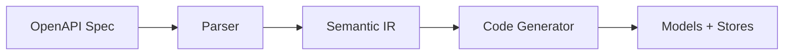

# NgRx OpenAPI Generator

Generate fully-typed **NgRx Signal Stores** from your OpenAPI specifications.

## What is it?

`ngrx-openapi-gen` transforms OpenAPI 3.x specs into NgRx Signal Stores using `@angular-architects/ngrx-toolkit`:

- **`withResource`** - HTTP resources for GET operations
- **`withMutations`** - Mutations for POST, PUT, DELETE
- **Type-safe models** - TypeScript interfaces from schemas

## Quick Example

**Input (OpenAPI):**

```yaml
paths:
  /api/tasks:
    get:
      tags: [Task]
      responses:
        '200':
          content:
            application/json:
              schema:
                type: array
                items:
                  $ref: '#/components/schemas/Task'
```

**Output (Signal Store):**

```typescript
export const TaskStore = signalStore(
  { providedIn: 'root' },

  withResource((store) => ({
    tasks: httpResource<TaskModel[]>(
      () => `${store._baseUrl}/api/tasks`,
      { defaultValue: [] }
    )
  }))
);
```

## Architecture



## Next Steps

- [Installation](./installation) - Set up the generator
- [Quick Start](./quick-start) - Generate your first stores
- [Domain Generation](./domain-generation) - How domains are created
- [Store API](./store-api) - Generated store features
